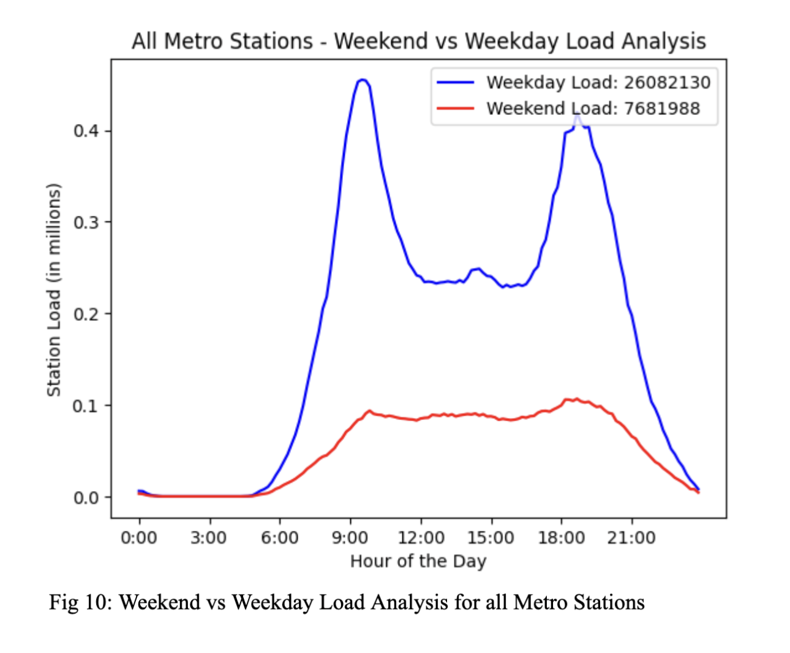
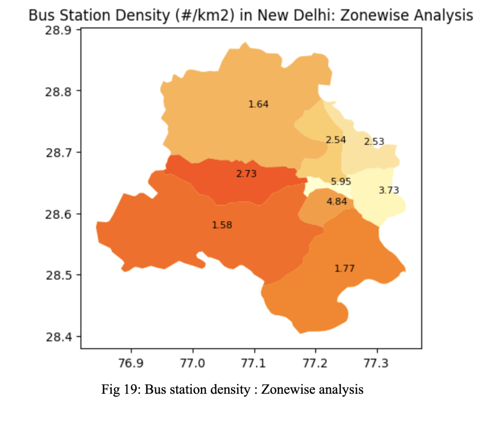
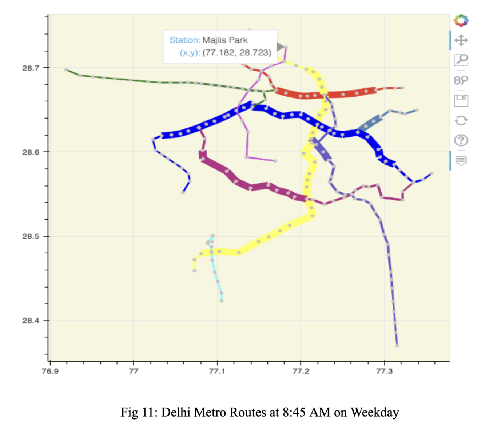

# Multimodal Transportation Analysis: Delhi Metro and Bus Systems

Analysis of passenger mobility patterns across Delhi's public transportation network, combining 16.8M+ metro entry-exit records with bus e-ticket and GTFS data to identify station loads, congested routes, and zone-level connectivity gaps.

**Full report:** [report.pdf](report.pdf)

## Key findings

- **Metro peaks:** Station load concentrates sharply at 9 AM and 6 PM on weekdays. Weekend load is roughly 30% of weekday load across the network.
- **Busiest metro stations:** Rajiv Chowk (596K weekday entries), Huda City Centre (571K), Karol Bagh (441K).
- **Bus hotspot:** Anand Vihar ISBT dominates bus traffic with 877K weekday entries, 2.7x the next busiest stop.
- **Zonewise bus density:** Central Delhi has the highest bus stop density (5.95 stops/km²); Southwest Delhi the lowest (1.58 stops/km²), suggesting uneven last-mile connectivity.
- **Route load (metro):** 9 AM weekday activity is concentrated on Blue, Red, Magenta, and Yellow lines; midday collapses to ~4 stations on the Blue line.

## Methodology

- **Passenger data processing:** 16.8M+ metro entry-exit records and bus e-ticket data, cleaned and standardized for consistency.
- **Name reconciliation:** Fuzzy matching (Levenshtein distance) to reconcile station names across sources (e.g., "Prem Nursery" vs "Prem Nurssary", "Ghitorni" vs "Ghitorny"), recovering >50% additional usable records in some cases.
- **Route load inference:** Metro network modeled as an undirected graph; shortest paths computed via Dijkstra's algorithm (implemented from scratch) to infer likely routes taken between entry and exit stations.
- **Geospatial analysis:** Bus stops attributed to Delhi's nine administrative zones via shapefile intersection; station coordinates scraped from Wikipedia using Selenium.
- **Load visualization:** Station load bucketed into 144 10-minute intervals per day; route load rendered as edge-thickness proportional to Z-score on a geographic map.

## Visualizations

Selected outputs from the analysis:


*Aggregate metro load across all stations: weekday vs weekend*


*Bus stop density across Delhi's nine administrative zones*


*Metro route load at 8:45 AM on a weekday; thicker edges indicate heavier load*

## Repository structure

```
multimodal-transportation-analysis/
├── Multimodal_Metro.ipynb    Metro analysis: data processing, station load, route load
├── Multimodal_Buses.ipynb    Bus analysis: e-ticket processing, station load, zonewise density
├── report.pdf                Full project report (B.Tech thesis, IIT Roorkee 2023)
├── requirements.txt
├── LICENSE
└── docs/   
```

## Running the notebooks

```bash
pip install -r requirements.txt
jupyter notebook
```

Open either notebook and run cells top to bottom. Note that the raw passenger data is not included in this repository due to size and redistribution constraints; the notebooks reference the DMRC hackathon dataset (2018) and Delhi bus e-ticket data. Contact me for guidance on obtaining these datasets.

## Tools and data sources

- **Data:** Delhi Metro Rail Corporation (DMRC) passenger entry-exit data (2018 hackathon release), Delhi bus e-ticket data, General Transit Feed Specification (GTFS) bus schedules, Wikipedia (station coordinates via Selenium scraping)
- **Stack:** Python, pandas, numpy, matplotlib, folium, geopandas, fuzzywuzzy, selenium

## Acknowledgments

Completed as part of the B.Tech project in Electronics and Communication Engineering at IIT Roorkee (2022–2023), under the supervision of Prof. Dheeraj Kumar. Co-authored with Arush Sharma.

## License

MIT

See [LICENSE](LICENSE).
